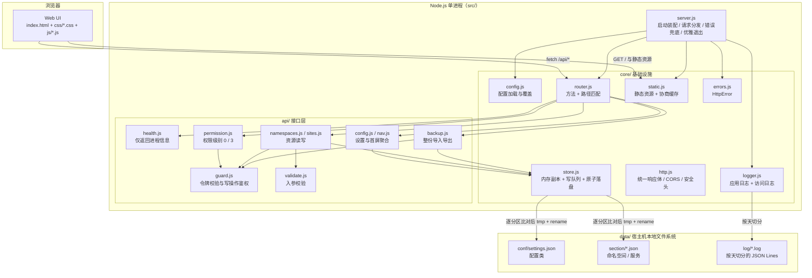
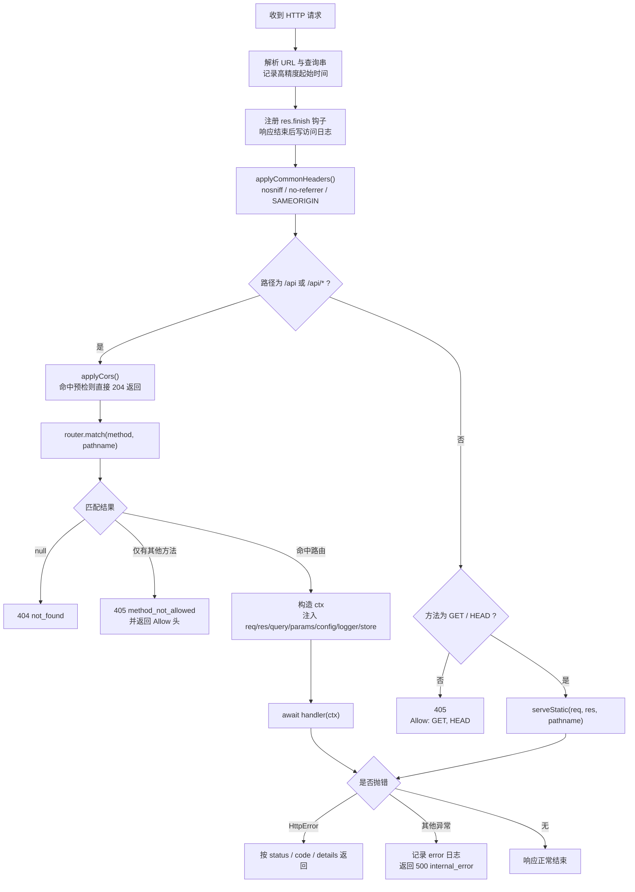
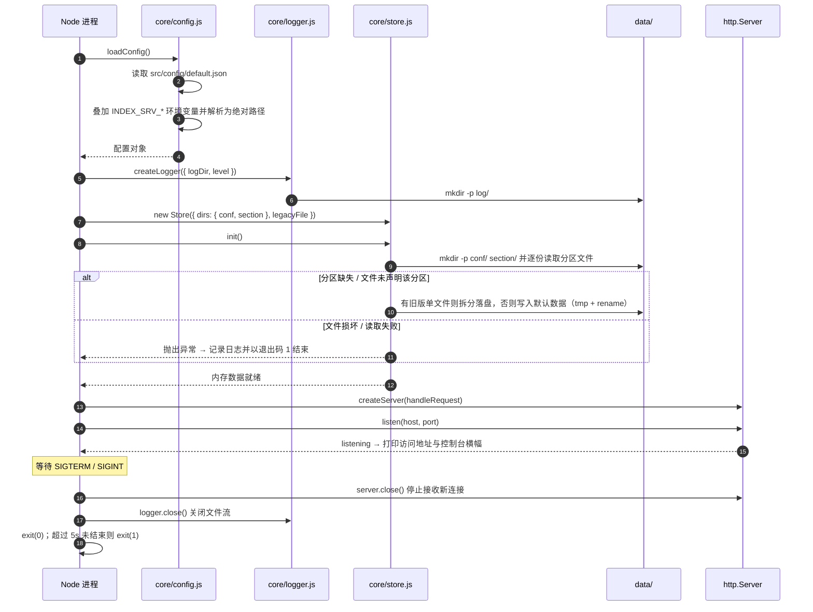
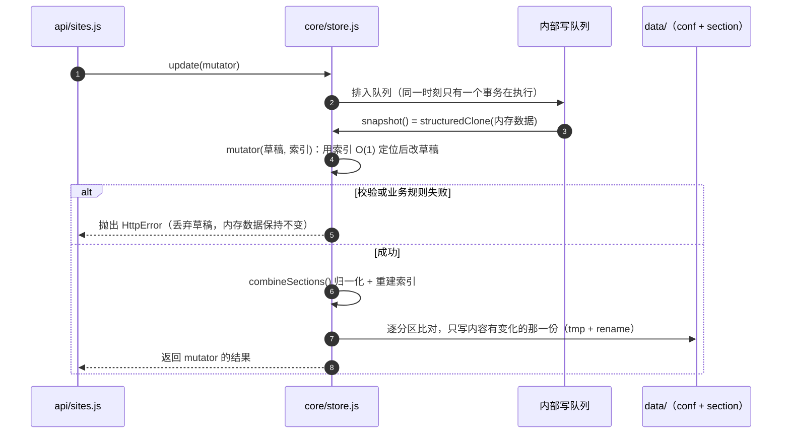
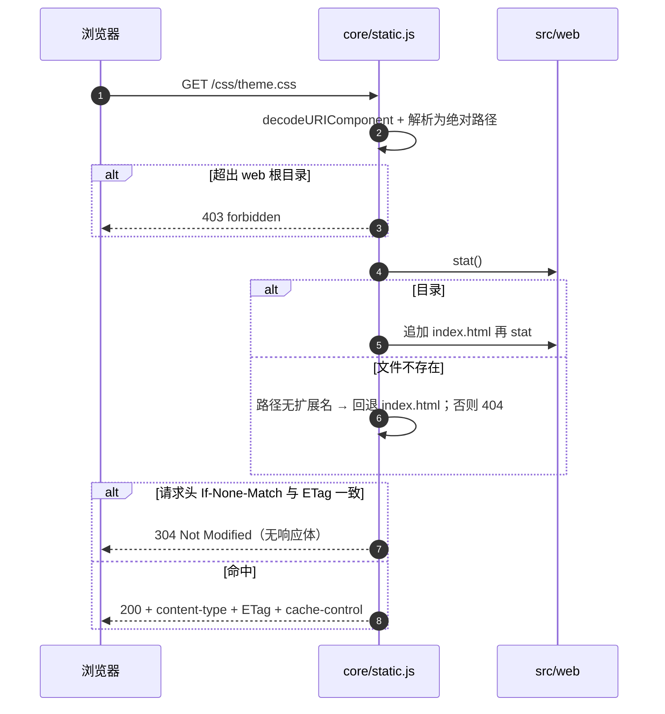
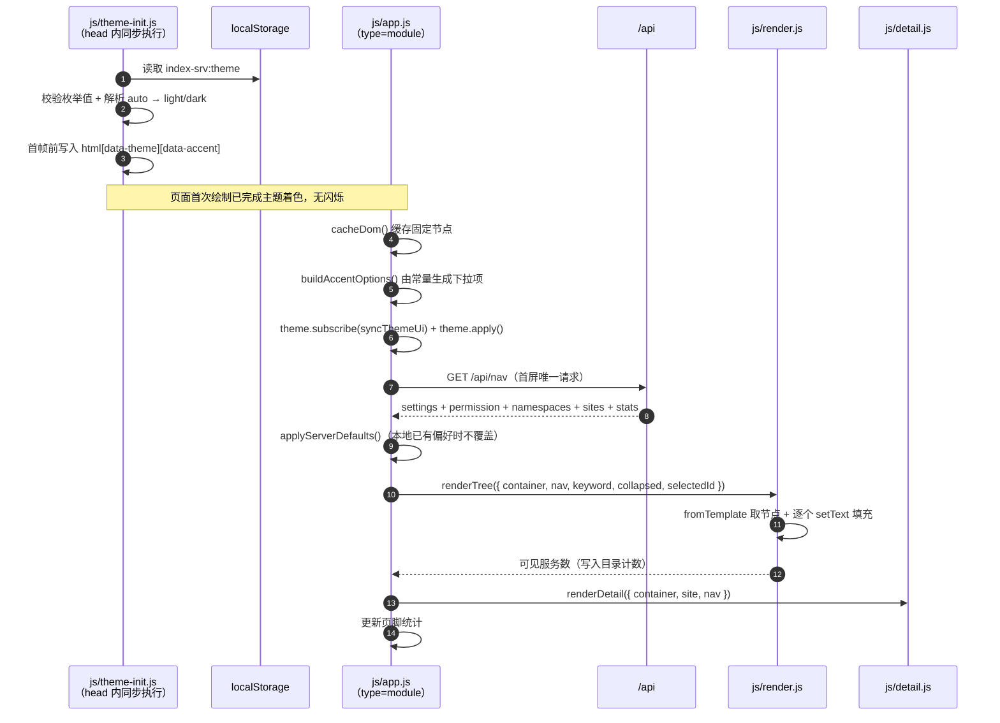
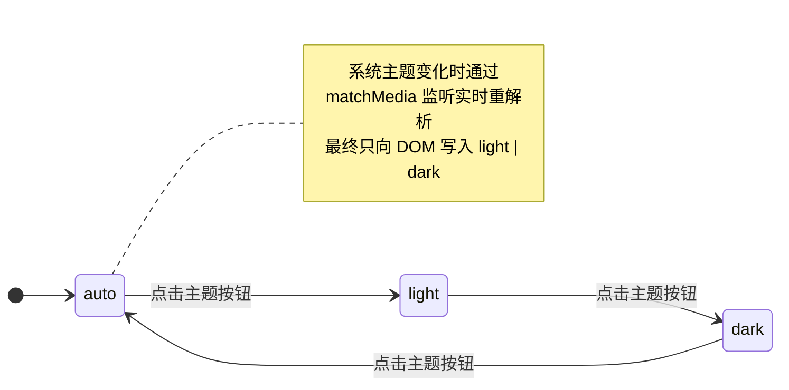
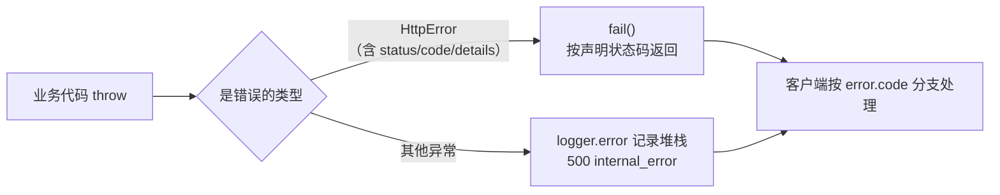
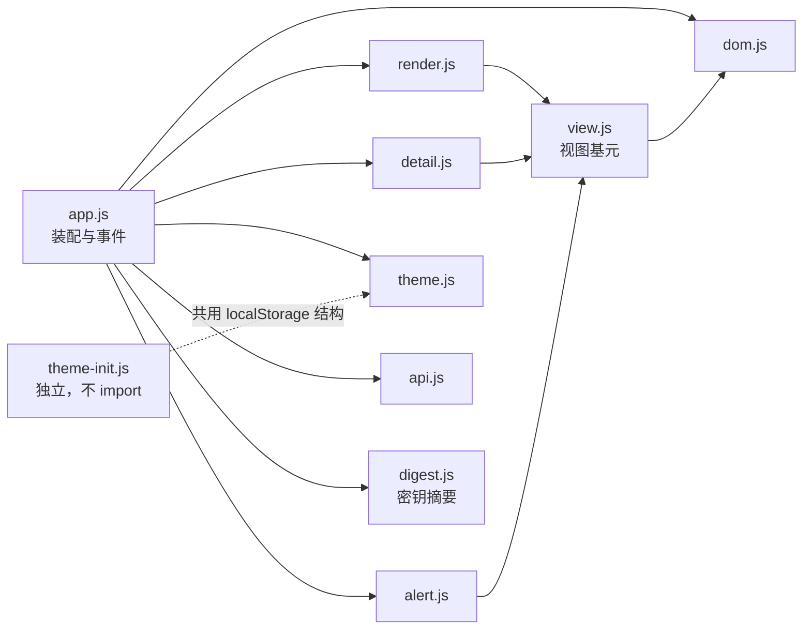
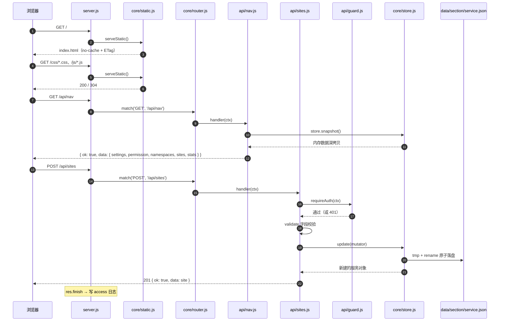

# index-srv 架构说明

本文记录项目的目录结构、整体架构（Mermaid 图）以及技术搭建与交互细节。部署与使用方式见根目录 [readme.md](../readme.md)，接口与前端约定见 [api.md](api.md)、[ui.md](ui.md)。

---

## 1. 系统概览

单一 Node.js 进程同时承担两个角色：

| 角色 | 实现 | 说明 |
| --- | --- | --- |
| API 服务 | `src/server.js` + `src/core/` + `src/api/` | 仅使用 Node 内置模块，提供 `/api/*` JSON 接口 |
| 静态资源服务 | `src/core/static.js` + `src/web/` | 直接吐出 HTML/CSS/JS，浏览器原生解析，无构建步骤 |

数据按语义拆成三份 JSON：配置类放 `data/conf/settings.json`，数据源放 `data/section/namespace.json` 与 `data/section/service.json`。启动时读入内存并建立 id 索引，写操作串行化、原子落盘，且只回写内容确实变化的那一份；日志按天切分写入 `data/log/`。另有一份不属于数据分区的配置类文件 `data/conf/service.schema.json`（新建服务的草稿骨架），同样在启动时读入，供编辑器生成新建草稿。

说明文档（`data/intro`，由 `storage.introPath` 配置）是**只读的 Markdown**：接口发剥掉 frontmatter 后的原文，渲染在浏览器端用 vendored 的 marked 完成，因此服务端不需要任何 YAML/HTML 解析依赖（frontmatter 只逐行读 `label` / `order` / `hidden` 三个字段）；配置指向目录时列出多篇（弹窗带目录栏，侧栏的名称/顺序/显隐由 frontmatter 在服务端定稿），指向单个 `.md` 时只有一篇（弹窗只有内容区）。

关键约束（贯穿全部设计）：

1. **运行期零依赖**：后端只用 Node 内置模块，前端只用浏览器原生能力 —— 唯一的例外是 `src/web/vendor/` 下 vendored 的第三方源码（当前只有 CodeJar），它以源码形式随仓库提交，仍是浏览器原生 ES Module。开发期的 2 个 devDependency（`lucide-static` 生成图标精灵、`codejar` 供 vendoring）都只产出提交进仓库的文件，运行与容器构建都不需要 `npm install`。
2. `src/` 放代码与 srv 配置，`data/` 放运行期数据 —— 容器部署只需挂载 `data/` 一个目录。
3. 前端 HTML / CSS / JS 严格分离，且不使用圆角与动效。

---

## 2. 目录结构

```
index_srv/
├── src/                      # 服务端与前端源码（srv 配置也在这里）
│   ├── server.js             # 入口：路由分发、错误处理、访问日志、优雅退出
│   ├── config/
│   │   └── default.json      # 服务端基础配置（端口、路径、鉴权、日志、CORS）
│   ├── core/                 # 基础设施（与业务无关，可复用）
│   │   ├── config.js         # 配置加载：default.json + INDEX_SRV_* 环境变量覆盖
│   │   ├── net.js            # 网络地址判定（纯函数）：权限提升白名单的 IP / CIDR 匹配
│   │   ├── logger.js         # 日志：stdout 文本 + 文件 JSON Lines，按天切分
│   │   ├── router.js         # 极简路由器：:param 参数 / 405 语义
│   │   ├── http.js           # 统一响应体、JSON 解析、安全响应头、CORS
│   │   ├── schema.js         # 数据模型（纯函数）：常量、归一化、id 索引、排序与统计
│   │   ├── store.js          # 数据存储：分区文件加载 / 迁移 + 内存副本 + 串行写队列 + 差异写回
│   │   ├── static.js         # 静态资源：ETag 协商缓存、目录回退、路径穿越防护
│   │   └── errors.js         # HttpError 与错误构造函数
│   ├── api/                  # 接口层（按资源分文件，统一在 index.js 注册）
│   │   ├── index.js          # 路由注册入口
│   │   ├── health.js         # GET /api/health
│   │   ├── permission.js     # GET/POST /api/permission（权限级别 0 / 3）
│   │   ├── config.js         # GET/PUT /api/config
│   │   ├── nav.js            # GET /api/nav（首屏聚合）
│   │   ├── namespaces.js     # 命名空间：新建 / 查询 / 批量排序（不提供删除）
│   │   ├── sites.js          # 服务 CRUD + 过滤 + 批量排序
│   │   ├── backup.js         # GET/PUT /api/store（导出 / 导入）
│   │   ├── guard.js          # 服务密钥摘要校验与写操作鉴权（x-service-digest / Bearer）
│   │   └── validate.js       # 入参校验，统一抛 validation_error(422)
│   └── web/                  # Web UI（原生实现，浏览器直接加载）
│       ├── index.html        # 唯一页面：结构 + <template> 模板 + 图标引用
│       ├── favicon.svg       # 站点图标（直角风格，手工维护的品牌标记）
│       ├── assets/           # 静态图片（页面底图等）
│       ├── icons/
│       │   └── sprite.svg    # 图标精灵（npm run icons 由 lucide-static 生成，勿手工编辑）
│       ├── vendor/
│       │   └── codejar.js    # CodeJar（npm run vendor 复制第三方源码，勿手工编辑）
│       ├── css/
│       │   ├── theme.css     # 设计令牌：明暗主题、强调色、状态色、字体、间距、形体
│       │   ├── base.css      # 重置、排版、通用工具类
│       │   └── components.css # 组件样式：页头、权限框、目录树、详情、页脚
│       └── js/
│           ├── theme-init.js # <head> 同步脚本：首帧前预设主题，防闪烁
│           ├── dom.js        # 最底层 DOM 工具：查询、填充、显隐、防抖
│           ├── digest.js     # 服务密钥摘要（Web Crypto 的 SHA-256，与服务端同算法）
│           ├── view.js       # 视图基元：模板取节点、空态、状态文案
│           ├── api.js        # /api 客户端：响应体解包、错误抛出、令牌管理
│           ├── theme.js      # 主题管理器：模式切换、强调色、持久化
│           ├── render.js     # 渲染层：数据 -> 左侧目录树（namespace / service）
│           ├── detail.js     # 渲染层：选中服务 -> 右侧 key: value 详情（值渲染管道）
│           ├── editor.js     # 服务 JSON 编辑器：挂载 CodeJar + 最小 JSON 高亮 + 草稿校验
│           ├── intro.js      # 说明弹窗的渲染：marked 解析 + 清洗（不使用 innerHTML）
│           ├── alert.js      # 提示消息：右上角浮层，自动关闭 + 点击关闭
│           └── app.js        # 应用入口：装配数据、事件、权限与渲染
├── data/                     # 运行期数据（容器挂载到宿主机的本地文件系统）
│   ├── conf/settings.json    # 配置类：面板标题、默认主题与显示开关
│   ├── conf/service.schema.json # 配置类：新建服务的草稿骨架（启动时读入，可扩展字段）
│   ├── section/              # 数据源：一份文件一个语义分区，可独立编辑
│   │   ├── namespace.json    #   命名空间
│   │   └── service.json      #   服务（含状态与自由属性）
│   ├── intro/                # 说明文档：Markdown，页头"说明"入口读取（目录或单个文件均可）
│   ├── log/                  # 日志：app-YYYY-MM-DD.log / access-YYYY-MM-DD.log（JSON Lines）
├── docs/
│   ├── arch.md               # 本文：架构与交互细节
│   ├── api.md                # API 接入规范
│   └── ui.md                 # Web UI 结构、主题与扩展约定
├── tests/                    # 回归套件（见 §9，零依赖 Node 脚本，npm test 入口）
│   ├── run.mjs               # 依次执行下列检查并汇总
│   ├── check-static.mjs      # 静态契约：隔离、id/class/令牌/图标闭环、依赖分层、死导出
│   ├── check-logic.mjs       # 纯逻辑：dom / theme / view / api
│   ├── check-render.mjs      # 渲染快照：与黄金基线逐字节比对（--update 刷新）
│   ├── check-docs.mjs        # 文档一致性：链接锚点、标题层级、mermaid、对代码的引用
│   ├── check-server.mjs      # 端到端冒烟：临时目录 + 随机端口起服务，校验资源与接口
│   ├── dom-shim.mjs          # 极简 DOM 垫片：让依赖 DOM 的模块能在 Node 里跑
│   └── fixtures/
│       ├── nav.json          # GET /api/nav 响应样本（覆盖渲染全部分支）
│       └── render.expected.json  # 渲染黄金基线
├── readme.md                 # 项目说明：快速开始、两种部署方式、配置与数据管理
├── Dockerfile                # 容器镜像（node:lts-alpine3.23，非 root 运行）
├── docker-compose.yml        # 容器编排（挂载 ./data，内置健康检查）
├── .env.example              # 部署变量模板
├── .dockerignore             # 构建上下文裁剪（排除 data / docs / tests）
├── .gitignore                # 忽略 node_modules / data 运行期目录 / .env
├── scripts/build-icons.mjs   # 开发期脚本：由 lucide-static 生成图标精灵
├── scripts/vendor-codejar.mjs # 开发期脚本：把 codejar 源码复制进 src/web/vendor/
├── package.json              # 无 dependencies；devDependencies 为 lucide-static 与 codejar（只产出提交进仓库的产物）
└── package-lock.json         # 锁定开发期依赖
```

约定：**`src/` 放代码与 srv 配置，`data/` 放运行期数据**。因此容器部署时只需挂载 `data/` 一个目录即可完成持久化。

---

## 3. 整体架构



模块依赖方向单一，不存在循环依赖：

```
server.js → api/* → core/*          （业务向下依赖基础设施）
server.js → core/{config,logger,router,http,static,store}
core/* 之间：仅 errors.js 被其它模块引用
```

---

## 4. 请求处理链路

### 4.1 分发流程



### 4.2 启动与退出时序



### 4.3 数据写入的串行与原子性

所有写操作（`POST` / `PUT` / `PATCH`）都经由 `Store.update()`，语义如下（系统没有 `DELETE` 接口，删除请直接编辑数据文件后重启）：



要点：

- **读**：`snapshot()` 返回深拷贝，调用方可安全持有，不会被后续写操作影响。
- **写**：以「内存数据为唯一权威」，文件只是持久化投影；`mutator` 抛错时草稿被丢弃，不会产生半成品状态。
- **队列**：`#queue` 串联全部事务，单次失败不会中断后续事务（失败被内部消化后继续排队）。
- **原子性**：先写 `*.tmp` 再 `rename`，避免进程中断导致 JSON 半截写入。
- **分区写回**：事务结束后逐分区比对，只落盘内容确实变化的那一份文件；未变化的分区既不写文件、也不刷新自己的 `updatedAt`（聚合 `updatedAt` 取各分区最新值，由接口动态计算）。
- **规范化**：每次读入与写入都过一遍 `combineSections()`，补齐缺失字段、过滤非法类型；服务若指向了不存在的命名空间，会回落到第一个命名空间而非消失。
- **自定义字段**：服务记录里模型之外的顶层键（`SITE_FIELDS` 之外）原样保留到数据文件，面板不解析也不展示 —— `normalizeSite` 用 `defineProperty` 挂载，`__proto__` 这类键也只是普通自有属性，不会改写原型。
- **索引**：内存数据同时维护 `id → 记录` 与 `命名空间 → 其服务` 两张表（`createIndex()`）—— 写操作靠它把「按 id 定位」从线性查找降为 O(1)，只读接口靠它 O(1) 取单条而不必克隆整份数据。索引在每次写入后重建，因此 mutator 内要「先定位、后增删」。
- **迁移**：仅当分区文件缺失、或文件里没有声明该分区（空壳 `{}`）时，才去读旧版单文件 `conf/sites.json` 并拆分落盘（`groups → namespaces`、`groupId → namespaceId`、补 `status` / `attributes`）；旧文件保留不动，迁移幂等。

### 4.4 静态资源与缓存协商



- ETag 由「文件大小 + 修改时间」生成（弱校验），默认 `cache-control: no-cache` 走协商缓存，开发时改文件刷新即生效。
- 需要强缓存时设置 `web.cacheMaxAge`（或 `INDEX_SRV_WEB_CACHE`），超过 0 会改为 `public, max-age=N`。
- `HEAD` 请求返回相同的响应头但不发送响应体。

### 4.5 前端首屏与时序



### 4.6 主题状态机



---

## 5. 技术搭建细节（服务端）

### 5.1 配置加载

配置只有一份物理文件 `src/config/default.json`，叠加环境变量后解析为绝对路径：

```
default.json → INDEX_SRV_* 环境变量覆盖 → 绝对路径解析（以 rootDir 为基准，解析出 dataDir / confDir / sectionDir / logDir / webDir）
```

- `INDEX_SRV_ROOT` 决定相对路径的基准（容器内为 `/app`），从而同一份配置文件可同时适配本地与容器。
- `INDEX_SRV_SECRET` 与其它变量同前缀，但**不进配置文件**（避免明文密钥入库）：只在启动时读取一次并转成摘要，之后明文即被丢弃。
- `INDEX_SRV_CORS_ORIGINS` 一旦非空，会**自动开启** CORS，无需同时改配置文件的 `server.cors.enabled`。
- 端口与数字型变量在加载阶段完成类型与范围校验，非法值回落到文件中的默认值。

### 5.2 路由匹配

`core/router.js` 用正则编译路径模式，不引入任何依赖：

| 模式 | 行为 |
| --- | --- |
| `/api/sites/:id` | `:id` 编译为 `([^/]+)` 并解码后放入 `ctx.params` |
| 结尾斜杠 | 正则尾部 `/?`，`/api/nav` 与 `/api/nav/` 等价 |
| 未命中方法 | 收集已注册的方法集合，返回 405 并附带 `Allow` 头 |

**注册顺序即优先级**：静态路径必须写在参数路径之前（例如 `/api/sites/order` 先于 `/api/sites/:id`），否则会被 `:id` 抢先匹配。

### 5.3 统一响应体与错误链路



- 成功一律 `{ ok: true, data }`，失败一律 `{ ok: false, error: { code, message, details? } }`，前端 `api.js` 只需一套解包逻辑。
- `errors.js` 预置语义化构造函数（`notFound` / `conflict` / `validationError` …），业务代码直接 `throw`，由 `server.js` 统一兜底。
- 响应头已发出时（例如流式响应中断）不再尝试写 JSON，直接 `res.destroy()`。

### 5.4 鉴权与安全

| 项 | 实现位置 | 行为 |
| --- | --- | --- |
| 写操作鉴权 | `api/guard.js` | 未配置 `INDEX_SRV_SECRET` 时一律拒绝（接口只读）；已配置时校验请求携带的摘要（`x-service-digest` 或 `Authorization: Bearer`） |
| 权限级别 | `api/permission.js` | 未配置密钥 → `3`(user)；带有效摘要 → `0`(super)；否则 → `3`。`POST /api/permission` 提交摘要提升 |
| 密钥存储 | `core/config.js` | 启动时把 `INDEX_SRV_SECRET` 转成 SHA-256 摘要，明文既不入配置文件也不留在内存；比较发生在摘要层面 |
| 定长比较 | `api/guard.js` | `timingSafeEqual` + 长度预判，避免时序侧信道 |
| 只读接口 | 设计约定 | 始终公开，便于免登录浏览面板（公网暴露需在反向代理层做访问控制） |
| 入参校验 | `api/validate.js` | 类型、长度、枚举、URL 协议白名单；错误统一 422 并带 `field` |
| 属性值类型 | `api/validate.js` / `core/store.js` | 自由属性支持 JSON 原语与嵌套数组/对象。写入侧越界即 422（深度 ≤ 4、容器 ≤ 50 项、字符串 ≤ 500）；读取侧对非法值静默丢弃，以容错手工编辑过的数据文件。两侧用同一套层级语义，避免「校验通过却在落盘时被丢」 |
| 请求体上限 | `core/http.js` | 默认 256 KiB，超限 413；非对象载荷 400 |
| 安全响应头 | `core/http.js` | `x-content-type-options: nosniff`、`referrer-policy: no-referrer`、`x-frame-options: SAMEORIGIN` |
| 路径穿越 | `core/static.js` | 解析后的绝对路径必须位于 web 根目录内，否则 403 |
| XSS | `web/js/*` | 全部动态内容经 `textContent` 写入，不使用 `innerHTML` |
| 容器加固 | `Dockerfile` / compose | 非 root（`node` 用户）运行 + `no-new-privileges` |

### 5.5 日志

`core/logger.js` 同时输出两个方向，且两类日志分离：

| 输出 | 内容形态 | 用途 |
| --- | --- | --- |
| stdout | 人类可读文本 `[ISO时间] LEVEL 消息 {JSON}` | `docker compose logs` 直接查看；`error` 走 stderr |
| 文件（JSON Lines） | 每行一个 JSON 对象 | 采集与检索，`jq` 可直接处理 |

- 文件按**类别 + 日期**切分：`app-YYYY-MM-DD.log`、`access-YYYY-MM-DD.log`；跨天时自动关闭旧流并创建新流。
- 访问日志字段：`time` / `method` / `path` / `status` / `durationMs` / `ip`（来源 IP 优先取 `x-forwarded-for` 首段，否则取 socket 地址）。
- 访问日志默认只落盘；`log.level=debug` 时同步打印到 stdout。
- 退出时 `logger.close()` 关闭全部文件流，避免日志丢失。

### 5.6 接口分层约定

| 层 | 只负责 | 不负责 |
| --- | --- | --- |
| `server.js` | 装配、分发、错误兜底、生命周期 | 任何业务字段 |
| `core/*` | 通用能力（配置、日志、路由、HTTP、存储、静态资源） | 具体资源语义 |
| `api/*` | 鉴权 → 校验 → 读写 Store → 组装响应 | 直接操作文件系统（统一走 Store） |

新增一个接口的固定动作：在 `src/api/` 建模块 → 在 `api/index.js` 注册 → 更新 `docs/api.md`。

---

## 6. 技术搭建细节（前端）

### 6.1 装载顺序与原因

```
1. 三个 css 外链        → 样式先于内容解析，避免无样式闪烁
2. js/theme-init.js     → <head> 内同步经典脚本，在首次绘制前写入主题属性
3. js/app.js            → type="module"，浏览器自动 defer，不阻塞解析
4. icons/sprite.svg     → 不写在 head 中，由页面的 <use> 触发按需加载，只请求一次并走 ETag 协商缓存
```

`theme-init.js` 之所以是同步经典脚本而非模块，是为了拿到**执行时机**：模块脚本默认 defer，首帧时主题属还未写入，深色偏好下会出现白屏闪烁。代价是该文件与 `theme.js` 共用同一份 `localStorage` 键值结构，二者需同步修改（已在 `docs/ui.md` 标注）。

### 6.2 模块职责与依赖方向



依赖严格单向，共四层：**`app` → 渲染模块（`render` / `detail` / `alert`）→ `view` → `dom`**。

- 渲染模块之间互不依赖：状态文案、模板取节点、空态这类公共构件集中在 `view.js`；
- `theme.js`、`api.js` 与 `digest.js` 是叶子模块，不 import 任何模块（只依赖浏览器 API）；
- `theme-init.js` 刻意不 import 任何模块 —— 经典脚本无法使用 `import`，代价是与 `theme.js` 共用一份 `localStorage` 键值结构，需同步修改；
- 无反向引用、无循环依赖、无全局命名空间污染。

### 6.3 渲染机制

- **模板驱动**：`index.html` 内用 `<template>` 声明 `tpl-namespace` / `tpl-service` / `tpl-detail` / `tpl-kv` / `tpl-empty` / `tpl-toast` 六段结构，渲染模块经 `view.js` 的 `fromTemplate()` 取到节点后填充。结构改动只改 HTML，无需触碰 JS 字符串。
- **文本填充**：统一 `setText()`（内部 `textContent`），从机制上消除 XSS 风险，也避免拼接 HTML 带来的转义问题。
- **显隐切换**：统一 `toggleHidden()` / `isHidden()`，内部操作 `hidden` **属性**。`hidden` 是 `HTMLElement` 的 IDL 属性，`SVGElement` 并未实现它，写 `node.hidden = false` 只会挂一个 JS 属性，元素仍被 `[hidden]` 规则隐藏。
- **图标复用**：图标全部来自 lucide（开发期由 `npm run icons` 生成 `icons/sprite.svg`），页面通过 `<use href="./icons/sprite.svg#名称">` 外链引用。颜色由 sprite 内的 `stroke="currentColor"` 跟随文字色，尺寸完全由 CSS `.icon` 控制，sprite 只请求一次并被浏览器缓存。
- **目录树**：namespace 一级、service 二级；折叠通过 `.node--collapsed` 直接改类（不重渲染，保留侧栏滚动位置），箭头用静态 `transform: rotate(90deg)` 表示展开。
- **状态色**：`data-status` 把状态色写入局部变量 `--status-color`，同一份规则同时驱动服务项左侧色条与详情状态徽标。
- **名称截断**：服务名与命名空间名 `ellipsis` 截断，全名走 `title` tooltip，状态文案写入 `aria-label`（不只用颜色传达信息）。
- **标题单行截断**：站点标题、服务标题与说明侧栏条目统一「`nowrap` + `overflow: hidden` + `ellipsis` + `min-width: 0`」，长标题按容器宽度截断、完整值走 `title` 属性（`check-static` 断言这四条声明并钉住 `intro.js` 的 `title` 写入、`check-render` 断言详情标题带 tooltip）。
- **命名空间兜底**：服务指向不存在的命名空间时归入「未分组」条目展示，保证不丢内容。
- **详情 key: value**：`appendRow()` 只搭行骨架（key 文本 + 值插槽），值由 `RENDER_RULES` 规则表按「key → 空值 → object → slice → 基本类型」的顺序分派，渲染函数签名统一为 `(node, value, context)`：`status` → 色调块、`url` → 链接、`object` → JSON 代码块、`slice` → 多个 chunk 块、其余 → 常规文本（数字与布尔等宽）。字段顺序为内置字段（`namespace` / `status` / `url` / `description` / `tags`）+ 自定义 `attributes` + `id`；`tags` 本身是数组，天然走 slice 规则。
- **空态**：无匹配结果时渲染 `tpl-empty`（文案为英文，区分「无数据」与「搜索无结果」）。`renderDetail` / `renderTree` 分别在空态给容器加 `.detail--empty` / `.tree--empty`，由 CSS 用 `margin: auto` 让整块在容器内居中，恢复内容后移除该类。侧栏之所以有可居中的空间，是因为 `.sidebar` 是列向 flex、`.tree` 占满剩余高度；`.tree` 不自设高度也不接管滚动，长列表仍在侧栏滚动。居中刻意不用 `align-items` / `justify-content` —— 容器高度不足时那会把内容挤到滚动条够不到的一侧。

### 6.4 交互细节

| 交互 | 实现 |
| --- | --- |
| 搜索 | 输入经 120ms 防抖后重渲染；匹配服务 `name` / `description` / `url` / `status` / `tags` / `attributes`，命中命名空间名则展示该命名空间全部服务；搜索期间强制展开命中项 |
| 目录折叠 | 点击 namespace 行切换 `.node--collapsed`（只改类，保留侧栏滚动位置） |
| 选中服务 | 点击服务项高亮并只重渲染右侧详情，不重建整棵目录树 |
| 键盘 | `/` 聚焦搜索框（输入态不劫持）、`Esc` 先关闭密钥弹窗否则清空搜索、`Tab` 走原生焦点顺序 |
| 主题切换 | 按钮以 `auto → light → dark` 循环，图标与无障碍标签同步更新 |
| 强调色 | 下拉框切换，写入 `data-accent` 并即时持久化 |
| 权限切换 | 点击页头权限组件：当前为 `3` 时弹出居中的密钥弹窗（内只有一个输入框，Enter 提交）；当前为 `0` 时直接清掉本地摘要切回只读。密钥在本地先算成 SHA-256 摘要才发出，`localStorage` 里存的也只是摘要 |
| 刷新 | 重新拉取 `/api/nav` |
| 状态反馈 | 统一走右上角提示消息（`alert.js`）：加载超过 400ms 才提示；失败给出原因并引导用刷新按钮重试；同一时刻只保留一条 |
| 新标签打开 | 由服务端设置 `openInNewTab` 控制 `target` 与 `rel` |

主题与布局的切换**只改 `<html>` 上的数据属性**，不写内联样式、不操作具体元素颜色 —— 样式归属完全由 CSS 决定。

### 6.5 前端与服务端的边界

| 关注点 | 归属 | 说明 |
| --- | --- | --- |
| 数据过滤 | 服务端为主 | `/api/nav` 已过滤 `enabled: false`，前端只做搜索过滤 |
| 排序 | 服务端 | 按 `order` 升序返回，前端不再排序 |
| 主题偏好 | 客户端优先 | 本地偏好 > 服务端默认值；服务端设置仅作为初始值下发 |
| 状态标注 | 服务端存储 | `status` 由人工在数据文件/API 中标注（不做自动探测），前端只按 `data-status` 上色与取文案 |
| 权限级别 | 服务端判定 | 由请求携带的密钥摘要决定 `0` / `3`，前端只展示，并负责在本地算好摘要后提交 |
| 字段显隐 | 服务端 | `showDescription` / `showTags` 由前端在渲染时读取 |
| 值的展示形式 | 前端 | 服务端只负责原样存取 JSON 值，展示成文本 / 分块 / 代码块由 `detail.js` 的值渲染管道按类型决定 |

---

## 7. 关键设计取舍

| 决策 | 原因 | 代价 |
| --- | --- | --- |
| 运行期零 npm 依赖 | 免除依赖升级与供应链风险，镜像无 `npm install` 步骤，启动即运行 | 路由、校验、日志需自实现，功能保持克制 |
| 单文件 JSON 存储 | 可读、可手工编辑、易备份、迁移只需一个文件 | 不适合大数据量与高并发写；当前定位为个人面板 |
| 状态手工标注 | 实现简单、语义可控（`coming` / `developing` 本就无法探测） | 服务真实存活状态不会自动反映，需要人工维护 |
| 内存副本 + 原子落盘 | 读取无 IO 开销，写操作简单且不会写出半截文件 | 运行中手工编辑文件不生效，需重启（已写入文档） |
| 前端无框架无打包 | 无构建步骤，源码即产物，便于长期维护与审计 | 复杂交互需手写，规模变大后需要自觉约束 |
| 图标用 lucide + 生成 sprite | 与 shadcn/ui 风格一致；产物约 4 KB，运行期不加载图标库、不增加依赖 | 增改图标需执行 `npm run icons`；外链 sprite 多一次请求，且依赖现代浏览器的外部 `<use>` 支持 |
| 直角 + 无动效 | 视觉克制、渲染开销低，符合工具类面板定位 | 视觉表现力有限 |
| 页头半透明 + `backdrop-filter` | 与底图连成同一张背景，滚动时内容从毛玻璃后经过；不透明度由 `--header-veil` 一个令牌控制 | 需要浏览器额外合成，滚动开销略增；不支持 `backdrop-filter` 时回落到更高不透明度（`.app-header` 的兜底规则）；透明度取 50% 时 secondary 文字只剩 2.93:1（略低于 3:1 门槛），`check-static` 会提示并反解出达标取值 |
| 权限提升白名单（`server.permissionAllowlist`） | 默认即放行回环与 RFC 1918 内网段：密钥即使泄漏，公网来源也无法借提升接口换取 super 会话级别 | 只按 TCP 对端地址判定（不信任 `X-Forwarded-For`），反向代理之后需由代理层保证来源可信；IPv6 仅支持精确地址；它不拦写操作 —— 写操作仍以摘要为准 |
| 视觉验证降级为 DOM 校验 + 人工验收 | 当前环境无任何浏览器内核，装内核属于重量级引入 | 真实布局、CSS 计算值与浏览器兼容性无法自动回归，需人工过一遍（见 §9.1） |
| 密钥摘要鉴权（两侧各算一次 SHA-256） | 明文密钥不落配置文件、不进内存、不出现在网络请求里，两侧只交换摘要 | 摘要本身即凭据，泄露等于密钥泄露，必须配 HTTPS 或仅内网；未配置密钥时接口整体只读 |
| 只读接口公开 | 面板可免登录直接浏览 | 公网暴露需依赖反向代理做访问控制 |
| 单进程承载 API 与静态资源 | 部署最简单，无需额外 Web 服务器 | 静态资源性能依赖 Node；可前置 Nginx 缓解 |

---

## 8. 扩展点

| 需求 | 改动位置 |
| --- | --- |
| 新增 API | `src/api/` 建模块 → `src/api/index.js` 注册 → 更新 `docs/api.md` |
| 新增服务字段 | `src/core/store.js` 的 `normalizeSite` → `src/api/sites.js` 校验 → `js/render.js`（目录树）与 `js/detail.js`（详情：复用或新增一个 `value*` 渲染函数） |
| 新增服务状态 | `src/core/schema.js` 的 `SITE_STATUSES` → `css/theme.css` 补 `--status-*` 亮暗令牌 → `css/components.css` 补 `[data-status]` 规则 → `js/view.js` 的 `STATUS_LABELS` 补文案 |
| 新增 UI 组件 / 令牌 | `src/web/index.html` + `css/components.css` + `js/render.js` / `js/detail.js`（跨模块复用的构件放 `js/view.js`）→ 更新 `docs/ui.md` |
| 新增图标 | `scripts/build-icons.mjs` 的 `MANIFEST` 加入 lucide 图标名 → `npm run icons` → 页面用 `<use href="./icons/sprite.svg#名称">` |
| 增加配置项 | `src/config/default.json` + `src/core/config.js`（如需环境变量）→ 更新 `readme.md` 配置表 |
| 调整回归套件 | 见 §9.4：新增渲染分支补 `tests/fixtures/nav.json` 场景，新增纯逻辑补 `check-logic`，新增跨文件约定补 `check-static` |

---

## 9. 回归套件

`tests/` 下是**零依赖的 Node 脚本**（不引入测试框架），`npm test` 一条命令跑完五项，用于在改动后确认几类「看不出来的破坏」没有发生。

### 9.1 视觉验证的现状：降级为 DOM 校验 + 人工验收

**当前环境无法直接做视觉验证**：没有任何可用的浏览器内核 —— MCP 的 Playwright 走 `chrome` 通道而 `/opt/google/chrome/chrome` 不存在，Playwright 的浏览器缓存目录与系统浏览器（chromium / chrome / edge）也均未安装。

因此界面验证在当下拆成两条互补的路径：

| 路径 | 覆盖范围 | 手段 |
| --- | --- | --- |
| **多方面 DOM 校验**（自动化） | 结构、类名、文案、条件分支、接口、资源投放 | 本套件五项检查；不依赖浏览器，可重复、可逐字节比对，失败能定位到具体场景与片段 |
| **人工验收** | 真实渲染、布局排版、CSS 计算值、字体与配色观感、滚动与响应式、浏览器兼容性 | 由人工打开 `npm start` 的页面逐项确认，不进入自动化 |

这套分工是**环境约束下的主动降级**，不是设计偏好。环境一旦具备浏览器（`npx playwright install chrome`，或把 MCP 参数改为 `--browser chromium` 后安装 chromium），即可补上自动化截图验收 —— 届时本节应改写为「已具备，做法见 …」，而不是继续保留降级说明。

#### DOM 校验为什么能顶上大部分

`src/web` 没有构建产物，界面回归最容易出在「DOM 结构拼装」这一层 —— 漏挂节点、类名写错、文案错位、条件分支走反。这些恰好都能被结构化文本比对捕获。因此套件自带一个**极简 DOM 垫片**（`tests/dom-shim.mjs`），只实现项目实际用到的能力，追求**确定性**而非还原度：同一份输入永远得到同一份序列化结果，于是「结构变化」被转换成可以逐字节比对的文本，差异还能直接定位到具体场景与片段。

垫片**覆盖不到**的部分一律归入人工验收，其已知差异（不解析 HTML 实体、不保留纯空白文本节点、不实现事件冒泡与样式计算）见 `tests/dom-shim.mjs` 头部注释。

### 9.2 五项检查

| 检查 | 单独运行 | 拦得住什么 |
| --- | --- | --- |
| 静态契约 | `node tests/check-static.mjs` | HTML 混入内联样式/事件；JS 引用了不存在的 id 或类；CSS 用了未定义的令牌、或留下未被引用的令牌；圆角与动效约束被破坏；布局不变量（`.shell` 的 80%、`min-height: 0`）被改掉；节点缓存选择器与页面结构不再匹配；模块依赖分层被打破、出现循环依赖或死导出；图标清单与 sprite 不一致 |
| 纯逻辑 | `node tests/check-logic.mjs` | DOM 工具（显隐属性、防抖）、主题状态机与偏好优先级、模板基元、API 客户端的解包与各类失败分支 |
| 渲染快照 | `node tests/check-render.mjs` | 目录树与详情的结构、类名、文案、条件分支；失败时打印基线与实际片段 |
| 文档一致性 | `node tests/check-docs.mjs` | 文档链接与锚点失效、标题层级跳级、mermaid 结构损坏、文档提到的模块/令牌/类名/标识符在代码中已不存在、新增模块未登记 |
| 端到端冒烟 | `node tests/check-server.mjs` | 服务起不来；`src/web` 下有文件投放失败；`/api/nav` 与数据文件不一致；**草稿骨架可配置**（自定义模板原样下发并剔除 `namespaceId`、文件缺失回落 `default`、内容损坏回落 `invalid`）；未知接口、路径穿越防护、协商缓存失效；**两种权限模式**（未配置密钥时只读、配置 `123456` 后摘要可提升并写入）；**分区写回范围**（改设置只写 `settings.json`、改服务只写 `service.json`）；**旧版单文件迁移**（只放 `conf/sites.json` 也能启动，数据不丢、索引可用）；**新建命名空间**（201 + 列表/详情可见 + 落盘后聚合 `updatedAt` 前进）；**编辑服务**（局部更新只写服务分区 + 未提交字段不被清空 + `LAST MODIFY` 前进 + 非法必填字段 422）；**自定义顶层字段**（新建与编辑都原样落盘、不丢）；**删除能力已移除**（`DELETE` 一律 405 且数据仍在） |

冒烟测试使用**临时数据目录 + 随机端口**，不触碰仓库内的 `data/`。

### 9.3 渲染基线的维护

`tests/fixtures/render.expected.json` 是渲染结果的黄金基线。**有意**改变界面时：

```bash
npm run test:update      # 重新生成基线
```

随后审阅 diff：基线里应当只有本次改动造成的差异。基线是「行为契约」而非构建产物 —— 它由 `tests/check-render.mjs` 生成，覆盖渲染全部分支，因此任何非预期的界面变化都会在 `npm test` 中被拦下。

该基线的 HTML 部分与「视图基元抽取」重构之前的实现逐字节一致，即它记录的是**已审计过的既有行为**，而不是随手抓取的当前输出。

`tests/fixtures/nav.json` 则是**手工构造**的 `/api/nav` 响应样本：在种子数据之上补了未分组服务、缺省描述与标签、空属性、无描述命名空间，以及一条职责为「**用一条服务覆盖全部展示形式**」的 `s-render-demo`（`值渲染样例`）。它同时带空描述与空标签，因此内置字段的空值分支也在同一场景里可见；该条目与 `data/section/service.json` 中的演示服务**同名同形**，便于在界面上对照查看。它不随数据文件变化，需要时手工增删条目并保持响应结构一致。

`check-render.mjs` 会对这条样例做**覆盖自检**：`s-render-demo` 的渲染结果必须命中每一种展示形式（status 色调块 / url 链接 / 空值占位 / object JSON 代码块 / slice chunk 块 / 基本类型文本 / 数字与布尔等宽），少任何一种即失败 —— 防止样例日后退化出覆盖空洞。

### 9.4 何时该扩展套件

| 改动 | 需要补的内容 |
| --- | --- |
| 新增渲染分支（新字段、新状态、新条件） | 在 `tests/fixtures/nav.json` 中补能覆盖该分支的数据 → `npm run test:update` → 确认新场景出现在基线 diff 中 |
| 新增纯逻辑模块 | 在 `tests/check-logic.mjs` 中补断言 |
| 新增跨文件约定 | 在 `tests/check-static.mjs` 中补一条检查项 |
| 新增前端模块 | 无需改动：依赖分层、死导出、资源投放三项会自动覆盖 |
| 新增接口 | 无需改动：冒烟测试覆盖 `/api/health`、`/api/nav` 与数据一致性；新接口的契约仍由 `docs/api.md` 承载 |
| 调整部署 | `Dockerfile` / `docker-compose.yml` → 更新 `readme.md` 对应章节 |
| 引入 npm 依赖 | **运行期依赖需先与作者确认**（见 `readme.md` 开发约定）；开发期工具建议登记为 `devDependencies` 并提交产物：生成类的参考 `lucide-static` + `npm run icons`，vendoring 类的参考 `codejar` + `npm run vendor`（产物放 `src/web/vendor/`，`editor.js` 通过 `../vendor/*` 引用，静态检查会核对导出名与分层） |

---

## 9. 附：请求全链路举例

以「页面加载并新建一个服务」为例，串起全部环节：


